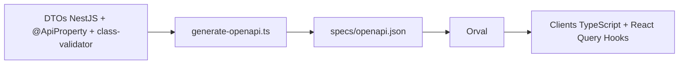

# Guide de Contribution - PlayerTracker

Bienvenue ! Ce guide vous aidera à contribuer efficacement au projet PlayerTracker.

## 📋 Table des Matières

- [Conventions Git](#-conventions-git)
- [Workflow de Développement](#-workflow-de-développement)
- [Architecture Code-First OpenAPI](#-architecture-code-first-openapi)
- [Code Review](#-code-review)

---

## 🌿 Conventions Git

### Branches

**Format :** `<type>/<description-kebab-case>`

#### Types de branches

- `feat/` - Nouvelles fonctionnalités
- `fix/` - Corrections de bugs
- `refactor/` - Refactorisation sans changement de comportement
- `chore/` - Tâches de maintenance (deps, config, etc.)
- `docs/` - Documentation uniquement
- `test/` - Ajout ou modification de tests
- `perf/` - Optimisations de performance

#### Exemples

```bash
feat/centralized-types-migration
fix/auth-null-undefined-mismatch
refactor/clean-legacy-types
chore/update-dependencies
docs/improve-readme
test/add-user-service-tests
perf/optimize-query-performance
```

---

### Commits

**Format :** `<gitmoji> <type>(<scope>): <description>`

#### Gitmojis courants

| Gitmoji | Code                 | Usage                   |
| ------- | -------------------- | ----------------------- |
| ✨      | `:sparkles:`         | Nouvelle fonctionnalité |
| 🐛      | `:bug:`              | Correction de bug       |
| ♻️      | `:recycle:`          | Refactorisation         |
| 🔧      | `:wrench:`           | Configuration           |
| 📝      | `:memo:`             | Documentation           |
| ✅      | `:white_check_mark:` | Tests                   |
| 🎨      | `:art:`              | Style/formatting        |
| ⚡      | `:zap:`              | Performance             |
| 🙈      | `:see_no_evil:`      | .gitignore              |
| 🔥      | `:fire:`             | Suppression de code     |
| 🚀      | `:rocket:`           | Déploiement             |
| 💄      | `:lipstick:`         | UI/UX                   |

#### Structure du message

```txt
<gitmoji> <type>(<scope>): <sujet>

<corps (optionnel)>
```

#### Types de commit

- `feat` - Nouvelle fonctionnalité
- `fix` - Correction de bug
- `refactor` - Refactorisation
- `chore` - Maintenance
- `docs` - Documentation
- `test` - Tests
- `perf` - Performance
- `style` - Formatage

#### Scopes courants

- `api` - Backend NestJS
- `web` - Application web Next.js
- `mobile` - Application mobile Expo
- `types` - Package types partagés
- `ui` - Package UI partagés
- `db` - Base de données / Prisma
- `auth` - Authentification
- `player` - Module joueurs
- `staff` - Module staff
- `docs` - Documentation

#### Exemples de commits

```bash
✨ feat(api): add players module with Code-First OpenAPI

♻️ refactor(api): migrate DTOs to Swagger decorators

🐛 fix(auth): resolve validation error on login

🔧 chore(deps): update Prisma to v5.8.0

📝 docs(readme): improve quick start section

✅ test(user): add user service unit tests

⚡ perf(api): optimize player queries with indexes
```

---

## 🔄 Workflow de Développement

### 1. Créer une branche

```bash
git checkout develop
git pull origin develop
git checkout -b feat/ma-nouvelle-feature
```

### 2. Développer

```bash
# Démarrer les services nécessaires
make dev-web  # ou make dev-mobile

# Faire vos modifications...

# Vérifier la qualité du code
make lint
make type-check
make test
```

### 3. Commit

```bash
# Ajouter les fichiers
git add .

# Commit avec message formaté
git commit -m "✨ feat(api): add new player endpoint
```

### 4. Push et Pull Request

```bash
# Push la branche
git push origin feat/ma-nouvelle-feature

# Créer une Pull Request sur GitHub
# Assigner des reviewers
# Ajouter des labels appropriés
```

---

## 🎯 Architecture Code-First OpenAPI

### Principe

**Les DTOs NestJS sont la source de vérité** pour l'API publique.

**Flux de génération :**



### Modification du schéma Prisma

Lorsque vous modifiez le schéma de base de données :

```bash
# 1. Modifier apps/api/prisma/schema.prisma

# 2. Générer la migration
make prisma-migrate

# 3. Mettre à jour les DTOs si nécessaire (indépendants de Prisma)
# Note: Prisma est utilisé UNIQUEMENT en interne, jamais exposé dans l'API
```

### Créer un DTO

**Create/Update DTOs (Input):**

```typescript
import { ApiProperty } from '@nestjs/swagger';
import { IsString, IsEmail, MinLength } from 'class-validator';
import { PartialType } from '@nestjs/swagger';

export class CreatePlayerDto {
    @ApiProperty({
        description: 'Prénom du joueur',
        example: 'John',
    })
    @IsString()
    @MinLength(1)
    firstName: string;

    @ApiProperty({
        description: 'Email du joueur',
        example: 'john@example.com',
    })
    @IsEmail()
    email: string;
}

// Pour UpdateDto, utiliser PartialType (tous les champs deviennent optionnels)
export class UpdatePlayerDto extends PartialType(CreatePlayerDto) {}
```

**Response DTOs (Output):**

```typescript
export class PlayerResponseDto {
    @ApiProperty({ description: 'ID du joueur', example: 1 })
    id: number;

    @ApiProperty({ description: 'Prénom', example: 'John' })
    firstName: string;

    @ApiProperty({ description: 'Email', example: 'john@example.com' })
    email: string;

    @ApiProperty({ description: 'Date de création' })
    createdAt: Date;

    // ⚠️ Jamais de champs sensibles/internes (password, deletedAt, etc.)
}
```

### Créer un nouveau module API

**Étapes pour créer un nouveau module :**

1. **Définir le modèle** dans `apps/api/prisma/schema.prisma` (optionnel si besoin BDD)
2. **Créer les DTOs** dans `apps/api/src/modules/{module}/dto/`
    - `create-{module}.dto.ts` avec décorateurs `@ApiProperty()` + `class-validator`
    - `update-{module}.dto.ts` avec `PartialType(CreateDto)`
    - `{module}-response.dto.ts` pour les réponses
3. **Créer le Controller** avec `@ApiTags()`, `@ApiOperation()`, `@ApiResponse()`
4. **Créer le Service** avec mapping Prisma → DTO (jamais exposer Prisma directement)
5. **Créer le Module** NestJS
6. **Commit** → Husky génère automatiquement `specs/openapi.json`
7. **Générer le client** → `make dev-web` ou `pnpm --filter @playertracker/web generate:client`
8. **Utiliser dans le frontend** → Import des hooks React Query générés

**Exemple rapide :**

```bash
# 1. Créer la structure
mkdir -p apps/api/src/modules/players/dto

# 2. Créer les DTOs avec Swagger decorators
# (voir exemples dans la section précédente)

# 3. Créer controller + service + module

# 4. Commit
git add .
git commit -m "✨ feat(api): add players module"
# → Husky régénère automatiquement le contrat OpenAPI

# 5. Générer le client web (fait automatiquement par make dev-web)
pnpm --filter @playertracker/web generate:client

# 6. Utiliser dans React
# import { useGetPlayers, useCreatePlayer } from '@/lib/generated'
```

---

## 👀 Code Review

### Checklist du reviewer

- [ ] Le code suit les conventions de nommage
- [ ] Les DTOs ont les décorateurs `@ApiProperty()` et `class-validator`
- [ ] Le mapping Prisma → DTO est correct (pas de champs internes exposés)
- [ ] Les tests passent (`make test`)
- [ ] Le linting passe (`make lint`)
- [ ] La vérification des types passe (`make type-check`)
- [ ] Le message de commit suit les conventions
- [ ] La documentation est à jour si nécessaire
- [ ] Le contrat OpenAPI est généré (`specs/openapi.json` à jour)

### Checklist de l'auteur (avant PR)

```bash
# Vérifier la qualité du code
make lint
make type-check
make test

# Build pour vérifier qu'il n'y a pas d'erreurs
make build

# Vérifier le statut Git
git status
```

---

## 📖 Ressources

- **[README.md](./README.md)** - Guide de démarrage
- **[Swagger UI](http://localhost:3001/docs)** - Documentation API interactive (quand l'API est lancée)

---

## 💡 Bonnes Pratiques

### Code

- ✅ Toujours ajouter `@ApiProperty()` sur tous les champs de DTO
- ✅ Utiliser `class-validator` pour la validation (`@IsString()`, `@IsEmail()`, etc.)
- ✅ Mapper Prisma → DTO dans les services (jamais exposer Prisma directement)
- ✅ Utiliser `PartialType()` pour les UpdateDto
- ✅ Éviter les `any` et `@ts-ignore`
- ✅ Préférer les constantes aux valeurs magiques
- ✅ Commenter le code complexe
- ✅ Documenter les endpoints avec `@ApiOperation()` et `@ApiResponse()`

### Git

- ✅ Un commit = une fonctionnalité/fix
- ✅ Messages descriptifs et clairs
- ✅ Utiliser les gitmojis appropriés
- ✅ Rebaser sur `develop` avant de push
- ✅ Squash les commits de fix avant merge

### Tests

- ✅ Tester les cas nominaux ET les cas d'erreur
- ✅ Mock les dépendances externes
- ✅ Viser au moins 80% de couverture
- ✅ Noms de tests descriptifs

---

## 🤝 Besoin d'Aide ?

- **Questions générales** : Ouvrir une issue sur GitHub
- **Bugs** : Créer une issue avec le label `bug`
- **Features** : Créer une issue avec le label `feature`
- **Documentation** : Créer une issue avec le label `documentation`

---

**Merci de contribuer à PlayerTracker !** 🎉
