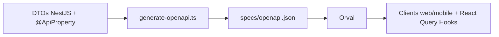

# PlayerTracker - Monorepo

Plateforme de gestion d'athlètes construite avec TypeScript, utilisant une architecture monorepo avec Turborepo et une
approche **Code-First OpenAPI**.

## 🏗️ Architecture

```txt
📦 PlayerTracker/
├── 📁 apps/                          # Applications
│   ├── 📱 api/                       # Backend NestJS + Prisma
│   ├── 🌐 web/                       # Application Next.js
│   ├── 🏠 landing/                   # Landing page Next.js
│   └── 📱 mobile/                    # Application mobile Expo (à venir)
├── 📁 packages/                      # Packages partagés
│   ├── 🔧 utils/                     # Fonctions utilitaires
│   └── ⚙️ config/                    # Configurations partagées
├── 📁 specs/                         # Contrats API
│   └── openapi.json                  # Contrat OpenAPI (généré)
└── 📋 Makefile                       # Commandes de développement
```

## ✨ Architecture Code-First OpenAPI

**Les DTOs NestJS sont la source de vérité** pour l'API :



### Flux de développement

1. **Définir les DTOs** (backend) avec décorateurs Swagger
2. **Commit les changements** → Husky génère automatiquement le contrat OpenAPI 🤖
3. **Générer les clients** : `pnpm --filter @playertracker/web generate:client`
4. **Utiliser les hooks** React Query générés automatiquement

## 🚀 Démarrage Rapide

### Prérequis

- Node.js 18+
- pnpm 8+
- Docker & Docker Compose

### Installation

```bash
# 1. Cloner le projet
git clone https://framagit.org/zowx/PlayerTracker.git
cd PlayerTracker

# 2. Configuration automatique
make setup
```

Le script `make setup` s'occupe de tout :

- ✅ Installation des dépendances
- ✅ Configuration de l'environnement (.env)
- ✅ Build des packages partagés
- ✅ Démarrage de PostgreSQL
- ✅ Configuration de la base de données

### Développement

```bash
# Démarrer tous les apps
make dev

# Démarrer uniquement API + Web
make dev-web

# Démarrer uniquement API + Mobile
make dev-mobile
```

**URLs de développement :**

- API : <http://localhost:3001>
- API Docs (Swagger) : <http://localhost:3001/docs>
- Web App : <http://localhost:3000>
- Landing : <http://localhost:3002>
- Mobile : Expo (voir console)

## 📦 Commandes Make

### Développement

```bash
make dev            # Démarre tous les apps
make dev-web        # Démarre API + Web uniquement
make dev-mobile     # Démarre API + Mobile uniquement
make ports          # Affiche les ports et aide
```

### Build & Tests

```bash
make build          # Build complet
make lint           # Linting du code
make type-check     # Vérification TypeScript
make test           # Lance les tests
```

### Base de données

```bash
make prisma-generate   # Génère le client Prisma
make prisma-migrate    # Lance les migrations
make prisma-studio     # Ouvre Prisma Studio
```

### OpenAPI & Génération clients

```bash
make generate-openapi  # Génère le contrat OpenAPI depuis les DTOs
make ensure-openapi    # Vérifie et génère le contrat si nécessaire
make check-openapi     # Vérifie que le contrat existe (pour CI)

# Puis générer les clients
pnpm --filter @playertracker/web generate:client      # Client web
pnpm --filter @playertracker/mobile generate:client   # Client mobile
```

### Docker

```bash
make docker-dev        # Démarre PostgreSQL
make docker-dev-down   # Arrête les services
make docker-prod       # Démarre la stack production
```

### Utilitaires

```bash
make help           # Affiche toutes les commandes
make clean          # Nettoie les fichiers de build
make status         # Statut des services Docker
```

## 📚 Packages Partagés

### Utils (`packages/utils`)

Fonctions utilitaires partagées.

```typescript
import { formatDate, capitalize } from '@playertracker/utils';
```

## 📖 Documentation

- **[CONTRIBUTING.md](./CONTRIBUTING.md)** - Guide de contribution
- **Swagger UI** - <http://localhost:3001/docs> (en développement)

---

**PlayerTracker** - Plateforme de gestion d'athlètes moderne 🏃‍♂️
