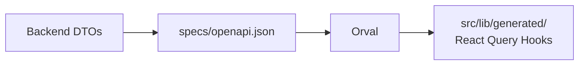

# PlayerTracker Web App

Application web Next.js pour la gestion d'athlètes et d'équipes - Dashboard staff.

## Stack

- **Next.js 16** (App Router) + **React 19**
- **shadcn/ui** (Radix UI + Tailwind CSS)
- **React Query** (TanStack Query) - État serveur
- **Orval** - Génération automatique du client API
- **React Hook Form** + **Zod** - Formulaires et validation
- **Zustand** - État global
- **@playertracker/theme** - Système de thème partagé

## Architecture Code-First API

Le client API est généré automatiquement depuis le contrat OpenAPI du backend :



## Structure du projet

```txt
apps/web/
├── src/
│   ├── app/                  # Routes (Next.js App Router)
│   │   ├── (auth)/           # Routes publiques (login, register)
│   │   ├── (protected)/      # Routes protégées (dashboard, players, etc.)
│   │   ├── globals.css       # Styles globaux + variables CSS
│   │   └── layout.tsx        # Layout racine avec providers
│   ├── components/
│   │   ├── ui/               # shadcn/ui components (15 composants)
│   │   └── auth/             # Composants d'authentification
│   ├── contexts/
│   │   └── auth-context.tsx  # État d'authentification global
│   ├── lib/
│   │   ├── api-client.ts     # Instance Axios avec intercepteurs JWT
│   │   └── generated/        # Client API généré (React Query hooks)
│   ├── middleware.ts         # Protection des routes
│   └── providers/            # Providers React (Query, Theme)
├── orval.config.ts           # Config génération client API
└── tailwind.config.js        # Config Tailwind + @playertracker/theme
```

## Démarrage rapide

```bash
# Depuis la racine du monorepo (recommandé)
make dev-web    # Démarre API + Web (avec génération client API)

# Ou depuis apps/web
pnpm dev        # Port 3000
```

## Commandes

```bash
# Développement
pnpm dev                    # Démarre Next.js sur :3000

# Build
pnpm build                  # Build pour production
pnpm start                  # Démarre en production

# API Client
pnpm generate:client        # Génère le client depuis OpenAPI

# Code quality
pnpm lint                   # ESLint
pnpm type-check             # TypeScript
pnpm format                 # Prettier
```

## Variables d'environnement

```env
NEXT_PUBLIC_API_URL=http://localhost:3001
NEXT_PUBLIC_FRONTEND_URL=http://localhost:3000
```

## Pages

### Publiques (auth)

- `/login` - Connexion (email/password + Google OAuth)
- `/register` - Inscription
- `/forgot-password` - Récupération mot de passe

### Protégées (dashboard)

- `/dashboard` - Dashboard principal avec cartes de statistiques
- `/players` - Liste des joueurs (à venir)
- `/teams` - Gestion des équipes (à venir)
- `/calendar` - Calendrier (à venir)
- `/questionnaires` - Questionnaires (à venir)
- `/metrics` - Métriques (à venir)
- `/settings` - Paramètres (à venir)

## Authentification

- **JWT** avec refresh tokens
- **Middleware** Next.js pour protection des routes
- **Auto-refresh** tokens sur 401 via intercepteur Axios
- **Stockage** : localStorage (tokens) + cookies (validation côté serveur)

## Client API

Hooks React Query générés automatiquement :

```tsx
import { useAuthControllerLogin, useGetPlayers } from '@/lib/generated';

// Connexion
const loginMutation = useAuthControllerLogin();
await loginMutation.mutateAsync({
    data: { email, password },
});

// Récupérer les joueurs
const { data: players } = useGetPlayers();
```

## Composants UI (shadcn/ui)

Composants disponibles dans `src/components/ui/`

## Thème

- **Mode clair/sombre** avec `next-themes`
- **Athletic Balance** palette depuis `@playertracker/theme`
- **Couleurs:** Performance Orange, Wellness Teal, Innovation Violet
